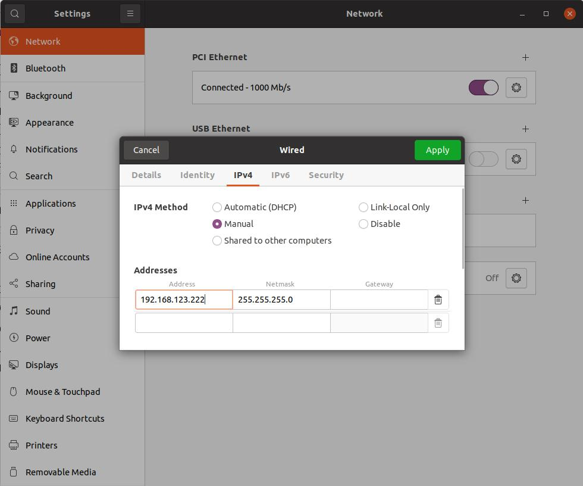
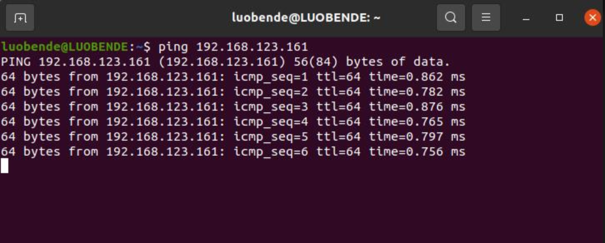
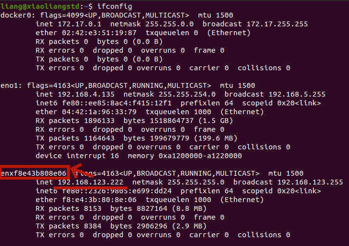

# G1 Robot Operation Document
*Teleoperation and G1 handling guide.*

---

## Table of Contents
1.  [G1 Humanoid Robot Guide](#g1-humanoid-robot-guide)
2.  [Installation](#installation)
3.  [Usage](#usage)
4.  [Network Configuration](#network-configuration)
5.  [Safety](#safety)
6.  [Troubleshooting](#troubleshooting)
7.  [Inspire Hands Gen 4](#Inspire-Hands-Gen-4)

---

## G1 Humanoid Robot Guide

This guide covers the essential setup and operation of the **Unitree G1 Humanoid Robot**.

### Prerequisites

#### Required Skills
-   **Linux:** Basic command line skills.
-   **ROS2:** Familiarity with ROS 2 concepts (nodes, topics).
-   **Programming:** Python or C++ for custom development.

#### PC Minimum Requirements
-   **RAM:** 8 GB+
-   **Storage:** 50 GB free
-   **GPU:** no GPU requirement unless adding some 3rd party policies
-   **OS:** Ubuntu 22.04 LTS

### Remote & App Control
For assistance with the remote controller or mobile app, contact **Soofiyan**.

---

## Installation

Follow these steps to set up the control environment and necessary software packages.

### 1.1. Inverse Kinematics dependencies
First, create and activate a new Conda environment. Then, install the required packages.

```bash
$ conda create -n tv python=3.10
$ conda activate unitree
(unitree) $ conda install pinocchio -c conda-forge
(unitree) $ pip install meshcat
(unitree) $ pip install casadi
````

### 1.2. Unitree SDK

Next, clone and install the `unitree_sdk2_python` library.

```bash
# Install unitree_sdk2_python.
(unitree) $ git clone [https://github.com/unitreerobotics/unitree_sdk2_python.git](https://github.com/unitreerobotics/unitree_sdk2_python.git)
(unitree) $ cd unitree_sdk2_python
(unitree) $ pip install -e .
```

### 1.3. Teleoperation Dependencies Setup

Finally, clone the g1 teleoperation repository and install its specific requirements.

```bash
(unitree) $ cd ~
(unitree) $ git clone git@github.com:Soofiyan/g1_teleoperate.git
(unitree) $ cd ~/g1_teleoperate
(unitree) $ pip install -r requirements.txt
(unitree) $ pip install empy==3.3.4
(unitree) $ pip uninstall typing
```

### 1.4. (Optional) ROS2 install

Go through the README.md file of this repository: [unitree\_ros2](https://github.com/unitreerobotics/unitree_ros2).

-----

## Usage

### How to run the robot ik on meshcat

```bash
# Go to the g1_teleoperate root folder
(unitree) $ cd g1_teleoperate/teleop/robot_control
(unitree) $ python robot_arm_ik_og.py
```

-----

## Network Configuration

This section explains how to establish a direct network connection between your computer and the robot.

### Configuration Steps

1.  Connect a network cable from the robot to your computer.
2.  Enable USB Ethernet on your computer.
3.  The robot's IP address is fixed at **192.168.123.161**. You must set your computer's USB Ethernet IP to the same subnet.
    *Set your computer's IP to **192.168.123.222**.*



### Testing the Connection

To verify the connection, ping the robot from your computer's terminal:

```bash
ping 192.168.123.161
```



A successful reply indicates the connection is working.

### Identify Your Network Device

You need to find the network card name assigned to this connection. Use the `ifconfig` command.

In the example below, the network card name for the IP **192.168.123.222** is `enxf8e43b808e06`. Note this name, as it's required to run the control examples.


-----

## Safety

*(This section is under development.)*

-----

## Troubleshooting

*(This section is under development.)*


## Inspire Hands Gen 4

### Setup and Installation

Follow these steps to set up the necessary software for the Inspire Hand.

```bash
# 1. Clone the repository
git clone https://github.com/Soofiyan/inspire_hand_ws.git
cd inspire_hand_ws

# 2. Install the Unitree SDK
cd unitree_sdk2_python
pip install -e .

# 3. Install the Inspire Hand SDK
cd ../inspire_hand_sdk
pip install -e .

# 4. Install required Python libraries
pip install pynput
pip install pymodbus==3.6.9
```

-----

### Read Sensor Data

Use the `data_handler_worker` callback function from the `sub_traget_LR.py` code to read sensor data.

### Control Modes

The Inspire Hand SDK offers various control modes. You can select a mode by its corresponding ID number.

| Mode ID | Binary | Description |
| :--- | :--- | :--- |
| 0 | `0000` | No Operation |
| 1 | `0001` | Angle Control |
| 2 | `0010` | Position Control |
| 3 | `0011` | Angle + Position |
| 4 | `0100` | Force Control |
| 5 | `0101` | Angle + Force |
| 6 | `0110` | Position + Force |
| 7 | `0111` | Angle + Position + Force |
| 8 | `1000` | Velocity Control |
| 9 | `1001` | Angle + Velocity |
| 10 | `1010` | Position + Velocity |
| 11 | `1011` | Angle + Position + Velocity |
| 12 | `1100` | Force + Velocity |
| 13 | `1101` | Angle + Force + Velocity |
| 14 | `1110` | Position + Force + Velocity |
| 15 | `1111` | Angle + Position + Force + Velocity |

-----

© ARClab. All Rights Reserved.
